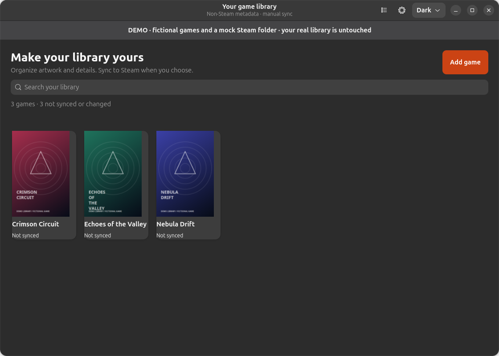

# Steam Library Metadata Manager

A native Linux desktop app for organizing **non-Steam game metadata and artwork**, then syncing supported shortcut fields to Steam when you choose.

**Version 0.1 — initial working preview.** Core and native GUI tests pass with isolated Steam fixtures. Live Steam metadata lookup is verified. Real-library sync and authenticated IGDB/SteamGridDB requests still need user acceptance testing; provider credentials are not bundled.



## What it does

- Compact cover library with search and clear sync status.
- Editable titles, descriptions, release dates, companies, genres and executable locations.
- Steam lookup by name or store ID; optional IGDB metadata and SteamGridDB artwork selection.
- Cover, landscape, hero, logo and icon previews, with local PNG/JPEG selection.
- Light, Dark and Follow System themes.
- **Save** keeps changes local. **Save & Sync** opens a change preview before writing to Steam.
- ZIP export/import of metadata, artwork and appearance, with keep/replace conflict choices.
- Missing-file warnings and relinking while retaining existing Steam shortcut identity.
- Backed-up Steam sync and guarded undo/recovery of the most recent change.

It does **not** launch games, install games, change game files or select Proton. Choose compatibility tools in Steam. Full descriptions and release information are shown in this app; standard Steam non-Steam shortcuts cannot display all of that metadata.

## Run on Ubuntu

Tested on Ubuntu 26.04, GTK 4 and libadwaita. Use **system Python**, not a Python environment that lacks the system GUI bindings.

Native dependencies: `python3`, `python3-gi`, `python3-cairo`, `gir1.2-gtk-4.0`, `gir1.2-adw-1`.

```sh
/usr/bin/python3 run.py
```

To install the app and launcher for your user:

```sh
/usr/bin/python3 tools/install.py
```

No root privileges are required by the installer. It copies application code to `~/.local/opt/steam-library-metadata-manager` and creates an applications-menu entry. Run the installer again after pulling an update. User data is kept separately.

## Safe demo

```sh
/usr/bin/python3 run.py --demo
```

The demo starts empty and uses a mock Steam folder under `~/.cache/steam-library-metadata-manager-demo`. Even its Sync button writes only to that mock folder. Demo provider settings are separate from the real app. Never run the inert demo `.exe` files.

## Providers

| Source | Purpose | Setup |
|---|---|---|
| Steam | Search, game details and available official artwork | No API key |
| IGDB | Search, descriptions, release/company/genre data and available cover/hero images | Your Twitch client ID and secret; the app obtains a temporary token |
| SteamGridDB | Select community covers, heroes, logos and icons | Your SteamGridDB API key |

Use **Settings → Providers** in the title bar. Credentials are stored in a permission-restricted local file, not encrypted; they are never included in ZIP backups. Steam uses public Store endpoints, which may change or be unavailable by region. Artwork is not guaranteed for every game. IGN is excluded from this version.

Provider documentation: [IGDB](https://api-docs.igdb.com/), [SteamGridDB](https://www.steamgriddb.com/api/v2).

## Workflow

1. Choose **Add game**, search by title or provider ID, and select a metadata match. You can also enter details manually.
2. Choose the executable in Steam settings, review/edit the details and choose artwork.
3. Save locally. You may close and reopen the app without syncing.
4. Exit Steam completely. Choose **Save & Sync** or **Sync saved version**, then choose your Steam account.
5. Review the exact changes and confirm. Keep Steam closed until the operation completes.
6. Reopen Steam and choose your desired compatibility tool there.

The app never writes purchased Steam game records. It edits only `shortcuts.vdf` and specific artwork files for the selected non-Steam shortcut. An existing matching executable is updated instead of duplicated. Ambiguous duplicates are refused. Metadata lookup IDs never replace Steam launch IDs.

## Data and backups

- Library/artwork: `~/.local/share/steam-library-metadata-manager` (or `XDG_DATA_HOME`).
- Provider configuration: `~/.config/steam-library-metadata-manager/providers.json` (or `XDG_CONFIG_HOME`), mode 0600.
- Steam recovery journals: `steam-backups` within the library directory. These contain local paths and account mappings and are deliberately excluded from portable exports.
- ZIP backups contain metadata, artwork and appearance, **not** game binaries, saves, Proton prefixes or credentials. Executable path strings are included for later relinking.

Import validates archive paths, dimensions, sizes, checksums and schema. Imports clear Steam destination mappings and never synchronize automatically. Maximum import size is 512 MiB uncompressed; individual images are limited to 20 MiB, 8192 pixels per side and 32 megapixels. ZIPs are unencrypted; keep private backups private.

Find ZIP export/import and Undo in **Settings → General**. Delete game removes only the local library entry; it keeps game files and existing Steam shortcuts.

Undo checks that Steam files still match the version this app wrote. If someone else changed them, it refuses to overwrite those changes. An interrupted sync is recorded for recovery; do not manually delete recovery journals. Steam does not share our lock, so keep it closed throughout sync/undo.

## Development and verification

```sh
python3 -m unittest discover -s tests -v
python3 -m compileall -q steam_library
# Requires an active Linux desktop session; operates only on temporary fixtures:
/usr/bin/python3 tools/ui_smoke.py
```

The GUI check exercises themes, editing, local-only save, explicit preview/confirmation, fixture sync, undo, ZIP restoration, filtering and detail scrolling. Screenshots use fictional artwork generated by the demo, not third-party game assets.

See [design](docs/DESIGN.md), [milestones](docs/ROADMAP.md) and [validation notes](docs/VALIDATION.md).
