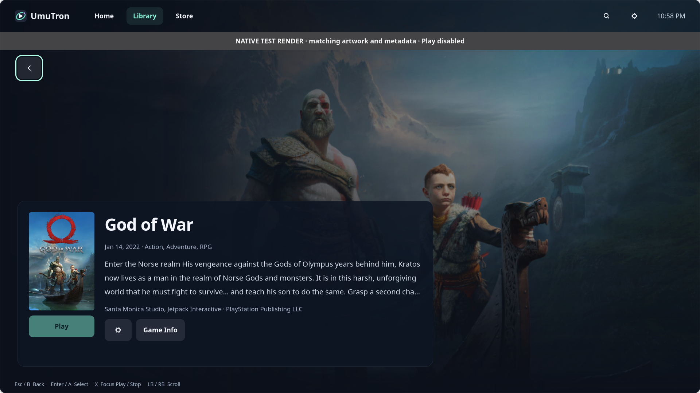
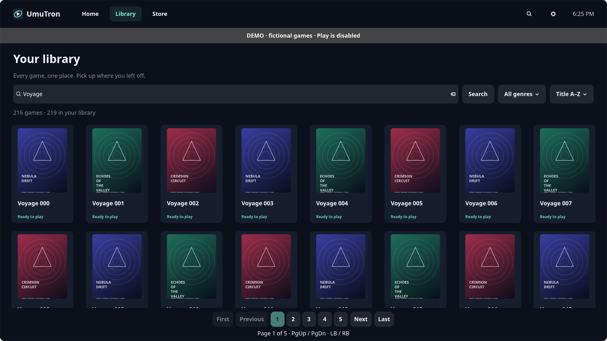
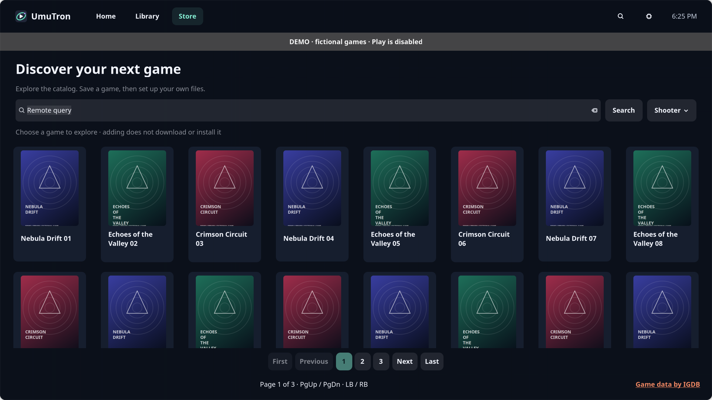

# UmuTron

[Source repository](https://github.com/krunaldodiya/UmuTron)

A native Linux library for preinstalled games and Windows installers, metadata/artwork, and explicit Play through **UMU + Proton**. No Steam client, account or synchronization is required. The IGDB Store uses a separately configured HTTPS metadata service; the saved Library works offline.



## GNOME dock identity — 0.4.15

The visible application entry is now `io.github.game_library_launcher.desktop`, matching the unchanged GTK/Gio application ID. GNOME could not associate the earlier `game-library-launcher.desktop` name with the running window, resulting in a generic dock icon and missing pin/favorites action. The installer retains that older desktop ID as a launchable `NoDisplay=true` compatibility entry, with the same Exec and icon, so existing shortcuts and Workstation Modes still work without a duplicate applications-menu item. It is not marked `Hidden` or deleted.

The canonical entry declares `StartupWMClass=io.github.game_library_launcher`; GTK's program name is set to the same identity before startup for X11 matching. The existing `game-library-launcher` icon name, install/data/config directories, Python package, library IDs and Workstation `app:game-library-launcher` resource stay unchanged. No favorites are added, removed or reordered. New pinning uses the canonical desktop ID. Close/reopen an older running instance with its normal explicit Exit action if necessary; no game or desktop session restart is needed.

This follows [GNOME's application-ID contract](https://developer.gnome.org/documentation/tutorials/application-id.html) and [desktop entry NoDisplay/StartupWMClass semantics](https://specifications.freedesktop.org/desktop-entry-spec/latest/recognized-keys.html).

## UmuTron branding — 0.4.14

The app now appears as **UmuTron** in its window, Settings information, application menu and tray, with an original orbital/play SVG icon. Existing `game-library-launcher` install/data/config paths, compatibility desktop and icon identifiers, Python package name and Gio application ID remain stable. The rename requires no library or prefix migration. Saved prefix/runner configuration and Proton labels are retained; the per-game Prefix tab was removed in 0.4.23. Earlier screenshots below predate this branding update.

## Features

- Separate **Home**, **Library** and **Store**: observed recent plays, the complete saved collection, and IGDB discovery with genre filtering and pagination. Preview a Store title, then explicitly **Add to library**; executable/runtime setup is optional.
- Persistent installation status/logs; cancel/retry keeps installed files. Select and confirm the game executable after setup. Setup exit alone never means the game is ready.
- Reuse the installer prefix, registry/runtimes and resolved Proton version for Play. Play never reruns setup.
- One read-only detail page from all routes, with artwork and contextual **Add / Setup / Play / Stop**. Unsaved Store Add saves metadata only. Saved unconfigured games have primary Setup in desktop; fullscreen offers Open desktop Setup, which explicitly switches mode and opens the same game’s existing form. No editing or installer execution happens in fullscreen. The gear retains desktop Setup for configured games, metadata-only Remove for saved entries, and guarded Uninstall for installed games. Existing metadata and artwork are preserved; manual metadata/artwork authoring is removed from the normal flow.
- Optional overrides in collapsed **Advanced launch settings**, including Reset to defaults and custom paths. Normal Proton selection is visible in Setup.
- Close to tray; **Show UmuTron** and explicit **Exit**. Without a supported tray host, close minimizes instead of making the app inaccessible. Reopening activates the existing instance.
- One app-owned game or installer at a time. Stop targets only that launch's verified owned processes. Active operations continue under their supervisor if you explicitly Exit; reopening reconnects.
- Two-tab Proton Manager: a protected **UMU-Proton** baseline and optional **GE-Proton** releases. Both catalogs update in the background and load older releases while scrolling; verified downloads support cancellation, retry and guarded uninstall of managed runners.
- Local ZIP import/export, responsive cover grids, title search/sort, light/dark/system themes, offline catalog snapshots and preserved custom artwork.

## Desktop and fullscreen

Home keeps a cinematic hero and recent-play rail, ordered by locally observed Play activity. Newly added games appear in Library, not Home. Library searches and filters all saved records locally by title and genre, then sorts and renders 48-item pages; it works offline and restores focus/scroll after Back. Store offers title search, official IGDB genres, 24-item pages and In library badges. Both use Search/Enter, genre controls, First/Previous, nearby numbered pages, and Next/Last with independent browsing state. Store shows only the current page and available directional controls when its exact total is unknown; the 1,000-page request limit is never presented as the true last page. All three open the same read-only detail page. Setup and advanced launch settings remain separate desktop dialogs.

The existing keyboard/controller mappings navigate native widgets. Card activation opens details; only explicit Play/Stop activation starts or stops an operation. Library and Store support PageUp/PageDown or LB/RB page jumps; detail pages use those controls to scroll. Home history reflects two seconds of consistent selected-executable process evidence, not proof of rendered gameplay. Old libraries are not assigned invented history.

Desktop arrow keys move between Home/Library/Store header controls and game cards. Search fields and native selectors retain their own keys; Tab keeps normal GTK navigation.

Use **F11** or the tray's single mode action: **Switch to fullscreen** from desktop, or **Switch to desktop** from fullscreen. The tray follows GTK's reported window state, including external mode changes, rather than the saved next-launch preference. Fullscreen Options offers **Exit fullscreen** and **Exit**. Settings → General → **Default launch mode** selects the next-start mode and is included in library ZIP backups. Switching modes preserves the current selection and active operation; save/cancel an open editing dialog first.

Controller: D-pad/left stick navigates, A selects, B goes back, X focuses Play/Stop, Start opens fullscreen options, and LB/RB changes collection pages or scrolls details. Keyboard arrows, Enter, Escape and Page Up/Down are also supported. Optional native SDL2 (`libsdl2-2.0-0` on Ubuntu) reads mapped controllers only while the launcher has focus; it does not inject keys, grab the controller or consume game input in the background. Keyboard/mouse remain available without SDL2 or a controller.





These are isolated GTK test renders with fictional games and seeded play history, not live desktop screenshots. [Candidate validation and limitations](docs/CATALOG-VALIDATION.md).

## Catalog service and safe removal

UmuTron 0.4.24 provides separate Home, Library and live Store routes with a shared game detail page. Home reflects observed recent play; Library stays local and works offline; Store searches the configured metadata backend. Explicit Add saves metadata first. Setup configures existing game files or a local installer; automatic game downloads remain unavailable. Storage experiments and download-source prototypes are not included.

Configure `APP_BASE_URL` with the approved HTTPS UmuTron-API origin only (scheme, host and optional port), without an API path, query, credentials or fragment. For desktop-menu launches, save this nonsecret setting in `~/.config/game-library-launcher/catalog.json` (or `$XDG_CONFIG_HOME/game-library-launcher/catalog.json`):

```json
{"APP_BASE_URL": "https://your-catalog-service.example"}
```

Restart UmuTron normally after changing it. An environment `APP_BASE_URL` overrides that file. The file is separate from credentials, library metadata and portable backups. The desktop never needs a Twitch client secret or token and no remote host is hardcoded. Without a backend, saved games and Setup remain available; Store explains that it is not connected. Production backend deployment and credentials are managed separately.

For local integration, export these into the environment that starts the **native desktop app**:

```sh
export APP_BASE_URL=http://localhost:3000
export UMUTRON_ALLOW_LOOPBACK_HTTP=1
```

The client appends `/v1/genres`, `/v1/games`, or `/v1/games/<id>` itself. Do not append `/api/v1/catalog` or another route to `APP_BASE_URL`. UmuTron does not load the backend's `.env.local`; `IGDB_API_BASE_URL` is the backend's separate upstream setting.

Production requires the verified HTTPS backend origin and no HTTP opt-in. The default client rejects all HTTP. With the exact development switch `1`, only literal loopback hosts or `localhost` are accepted; `localhost` is pinned to `127.0.0.1`, environment proxies are bypassed, and redirects are refused. LAN addresses and nonloopback HTTP remain rejected. Requests contain only public catalog queries, with no library records, local file paths, cookies or credentials.

`UMUTRON_CATALOG_URL` remains a legacy environment alias **only when `APP_BASE_URL` is unset in both the environment and the config file**, subject to the same origin-only validation. An explicitly empty/invalid primary or malformed config disables the connection; it does not silently fall back to the old setting or a remote default.

Remove from library keeps game files, saves, prefixes and runners. Uninstall is a distinct action: first verify the dedicated installation folder in Setup, then confirm its exact path and file inventory. Ambiguous/shared folders, known save data, links, nested mounts and unclassified files are rejected. Interrupted uninstall retains local recovery information. Saves, prefixes and Proton are separate; no game or installer runs during verification. See [the ownership and recovery contract](docs/DESIGN.md#guarded-game-removal-and-recovery).

## Install

Use native Ubuntu packages `python3-gi python3-cairo gir1.2-gtk-4.0 gir1.2-adw-1`. The UI runs with the system Python, not an arbitrary environment without GI. Install UMU separately following [upstream instructions](https://github.com/Open-Wine-Components/umu-launcher). `umu-run` must be available on PATH or selected in advanced settings.

```sh
/usr/bin/python3 tools/install.py
```

This user-level installer writes code to `~/.local/opt/game-library-launcher` and creates the application menu entry. No root, game execution or library rewrite is performed. Open **UmuTron**. Use explicit **Exit**, then reopen an older running app to load the updated code (closing alone hides it to the tray); do not restart a game just to update its UI.

## Proton versions

Settings → Proton Manager has two tabs: **GE-Proton** offers optional releases, while **UMU-Proton** shows a protected baseline managed by UMU plus other installable or installed UMU versions. Fresh libraries inherit the mutable **UMU-Latest** policy; GE is neither installed nor selected automatically. If the baseline runner is absent, Settings says UMU prepares it on first explicit Play and does not download it when opened. A manually chosen default persists across reopen and refresh. The current baseline version appears once; separate same-version folders and exact saved selectors remain intact internally. Other UMU releases support explicit installation, default selection and guarded removal of managed runners. The selected tab header follows the displayed content during clicks, keyboard navigation and background refresh. The removed Valve tab stays removed; saved Valve/custom paths, exact release selections and per-game overrides remain usable without migration.

Choose **Set as default** on a build. Manage Game → **Proton version** offers **Use default** and exact available/installed versions. Saving a choice never downloads or executes a game. After explicit Play or Launch Installer, a missing exact GE/UMU build downloads, checks its published digest, installs atomically, and only then starts UMU with its absolute path. Failed/cancelled preparation never starts the game; retry keeps the selected version. Concurrent requests reuse the same completed verified installation. Partial archives are discarded and retries fetch a fresh copy.

Existing `UMU-Latest`/`GE-Latest` policies remain UMU-managed automatic selections. Existing custom paths and legacy installer pins stay readable without migration. Deliberate **Use default** overrides a historical installer runner pin while preserving the prefix; a blank legacy setting retains that pin. The installer’s resolved exact build is pinned at executable confirmation.

**Uninstall** applies only to UmuTron-managed runner folders and requires confirmation. Reassign the app default and affected game selections first. Active operations and runner leases block removal; detectable same-user process use is also checked. These advisory locks do not exclude programs outside UmuTron. Game files, prefixes, saves and custom runner folders are never removed by this action.

## Add and play

Choose Add Game, search the public Steam catalogue (or select IGDB), and select a result. Metadata and available artwork are saved automatically; the read-only detail page opens. Manual entry is an optional fallback. Metadata-only entries are valid and show **Set up to play**.

Later, controller → Manage Game opens one Setup screen without stage or Prefix tabs. Select an existing executable and working directory directly. UMU is discovered on PATH. The visible Proton version selector inherits the app default or selects a specific installed/downloadable build. Configuration never runs anything by itself.

Both installation actions stay under **More**: **Install game…** for a new entry and **Reinstall…** for an existing configuration, including preinstalled games. A missing configured executable stays a reinstall, with a reminder to check its drive/location. Either action opens a separate installer modal without execution. Select a trusted setup executable, review it and explicitly confirm the start; Reinstall has a distinct warning and defaults to Cancel. Choose the destination and handle agreements inside the Windows installer. Watch status/logs in the modal; closing it leaves an active installation running. On success, failure or cancellation, files stay intact. Reopen Manage Game later to retry or select/confirm the installed game executable and working directory. The picker opens the owned prefix's drive_c when available. Play uses the confirmed game file and pinned prefix/runtime. An unresolved automatic runner requires a concrete installed version and a retry rather than silently switching an installed game's runtime.

Never run games/installers with root/admin privileges. Compatibility, anti-cheat and hardware vary; an installer may create external files or require user interactions beyond this app's controls.

## Metadata and artwork

Add Game searches metadata first; pencil → Find metadata can change an existing match. Default **Steam catalogue (no credentials)** searches titles or public store IDs. No client/account is needed. These public endpoints may change or be region-restricted. Optional IGDB requires Twitch/IGDB credentials only when selected; missing keys do not block public search. SteamGridDB supplies optional community artwork in the metadata dialog. Manual text and local PNG/JPEG images work without accounts.

Credentials are permission-restricted local files, not encrypted and never exported. Service/runtime attribution remains accurate: [Steam catalogue](https://store.steampowered.com), [IGDB](https://api-docs.igdb.com/), [SteamGridDB](https://www.steamgriddb.com/api/v2), [UMU](https://github.com/Open-Wine-Components/umu-launcher), [GE-Proton](https://github.com/GloriousEggroll/proton-ge-custom/releases), [UMU-Proton](https://github.com/Open-Wine-Components/umu-proton/releases). Proton/UMU use Valve runtime components internally.

## Data and backup

Data/artwork: `~/.local/share/game-library-launcher`; credentials: `~/.config/game-library-launcher/providers.json`. XDG overrides are honored. Dedicated prefixes live under app data; custom paths are optional. Existing unrelated prefixes are refused. Installer history is private under `installation-sessions/<UUID>.json`; current journal/lock reconnect across UI restarts.

Earlier version-1 libraries/archives and custom overrides remain readable. The earlier metadata-manager library/credentials are copied only if the new library is absent, preserving originals and identities. No existing game, save, prefix, artwork or Steam shortcut is deleted by this update.

ZIP backups include metadata/artwork, appearance and launch/installation path settings. They exclude game files, saves, prefixes, credentials, runner downloads and operation logs. Import never executes anything. Review/relink paths on a new PC and back up saves/prefixes separately.

## Verification

```sh
/usr/bin/python3 -m unittest discover -s tests -q
/usr/bin/python3 -m compileall -q game_library
ruff check game_library tests tools run.py --select F
/usr/bin/python3 tools/ui_smoke.py
dbus-run-session -- /usr/bin/python3 tools/tray_smoke.py
dbus-run-session -- /usr/bin/python3 tools/instance_smoke.py
```

`--demo` is isolated and cannot execute games/installers. Tests use inert temporary fixtures and synthetic artwork. See [design](docs/DESIGN.md) and [validation](docs/VALIDATION.md). No real repack installer, new license acceptance or campaign/gameplay test is performed automatically.

## Two-stage installer setup

Already installed shows executable and working-directory selection only. Install from installer first shows setup selection and installation controls; game executable selection is hidden until the installation attempt ends. Step 2 uses the same executable/working-directory flow and requires explicit confirmation, retaining the installer prefix and Proton version. Failed or cancelled attempts may also leave files, so selection remains available for recovery without implying success.

## Stage tabs

The former stage tabs and Already installed switch were replaced in 0.4.23 by a single Setup screen. More → Install game… / Reinstall… opens the installer modal in the same location for both states. After an attempt, confirm the installed game executable on Setup. Active operations disable changes and new starts; reopening the modal restores status/logs without stopping the operation or resetting its prefix/runner context.

## Public catalogue artwork repair — 0.3.5
Steam asset manifests supply modern hash-qualified cover and hero URLs, with legacy fallback. Cricket 26 cover/hero were downloaded live and added to its existing entry without replacing saved artwork or changing launch configuration. Its separate logo was unavailable through these public endpoints. Fixture tests cover hash paths, rejected paths and API failure fallback; native smoke uses isolated data.

Fullscreen layout checks include 1920×1080, 1280×720 and 1024×600 allocations, reachable scrollable content, horizontal selection scrolling and stable hero/rail position across games with differing artwork/text. Physical TV scaling and controller acceptance remain user checks.

## Per-game compatibility and automatic diagnostics — 0.4.11

UMU play and installer launches automatically request focused Proton exception/module logs. The latest Proton log for each game is stored locally under the app data directory `diagnostics/<game UUID>`; Manage Game → Open diagnostic logs opens that folder. If Proton fails before initializing, the operation log still records its failure and the folder may contain no Proton log. Logs can contain personal paths and are never included in portable ZIP backups. New attempts can replace the previous Proton log for the same game.

Manage Game → Advanced launch settings includes optional DLL compatibility overrides, for example `winmm=n,b`. These are validated, passed as a process environment value without a shell, and apply only to that game's launch. Blank does not inject an override and preserves existing prefix registry settings. Save persists the override; Cancel discards changes; Reset to defaults clears the draft launch override but does not edit the prefix registry or erase installer continuity. Portable metadata backups retain the saved compatibility preference but not diagnostic logs. No blanket automatic DLL fixes or guessed UMU identifiers are applied. Existing runner choice, prefixes, game files and saves are preserved.

## Diagnostic retention — 0.4.12
All automatic Proton logs live in the single app-data diagnostics directory, under game UUID folders. Routine logs request errors and exception warnings instead of verbose traces. Before launches and after owned processes finish, completed logs older than 14 days are deleted, each file is trimmed to its last 8 MiB, and oldest files are removed to enforce a 100 MiB total cap. Active log growth is not truncated while Proton is writing; these caps apply after completion.

Settings → General → Diagnostic logs → Clear all diagnostic logs asks for confirmation and removes only regular .log files in managed game folders. Symlinks and other files are ignored. The launch lock blocks clearing while any game or installer is active. Games, saves, prefixes, artwork and operation records are never deleted by this control.


### Prefix information and runtime maintenance (0.4.13)
Historical 0.4.13 behavior, superseded by 0.4.23: Setup / Manage Game included **Prefix** alongside Install and Game setup. The per-game Prefix tab is now removed; the separate global prefix-management work is not part of this UI release. It displays read-only prefix storage, creation state, runner version and conservative native/builtin/game-local runtime evidence. Game-specific requirements remain explicitly unknown. Manual VC++ v14 core installation requires a separate confirmation and interactive Microsoft license acceptance; .NET, legacy DirectX and runner components have no manual install/replacement actions. See [the behavior contract](docs/DESIGN.md#prefix-inventory-and-install-only-maintenance) and [validation and limitations](docs/PREFIX-VALIDATION.md).

Proton Manager distinguishes automatic latest selectors from installed versions without changing existing selections.


The 0.4.29 candidate makes Library/Store search reachable with navigation and keeps the focused card visible when moving either direction. Escape leaves a search field; keyboard caret arrows and Tab retain their native behavior. Home contains its hero, Recently played and Recently ready to play only. Games without a recorded setup date remain in Library without invented dates.
