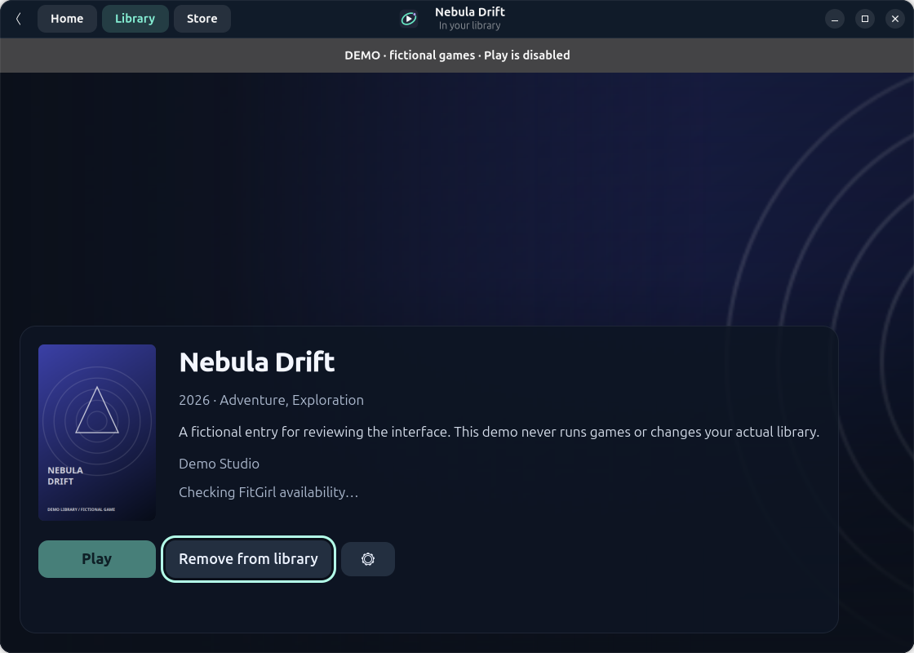
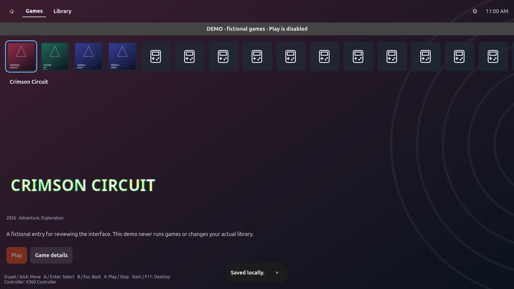

# Game Library Launcher

A native Linux library for preinstalled games and Windows installers, metadata/artwork, and explicit Play through **UMU + Proton**. No Steam client, account or synchronization is required. Public Steam catalogue search works without credentials.



## Version 0.4.1

- Metadata-first **Add Game**: search by title/ID, select, then automatically save metadata/artwork and open details. No executable or runtime settings required.
- Persistent installation status/logs; cancel/retry keeps installed files. Select and confirm the game executable after setup. Setup exit alone never means the game is ready.
- Reuse the installer prefix, registry/runtimes and resolved Proton version for Play. Play never reruns setup.
- Read-only game details with hero/cover/logo; **pencil → Edit Metadata**, **controller → Manage Game**. Normal Play/Stop remains on cards/details.
- Optional overrides in collapsed **Advanced launch settings**, including Reset to defaults and per-game runner selection.
- Close to tray; **Show Launcher** and explicit **Exit**. Without a supported tray host, close minimizes instead of making the app inaccessible. Reopening activates the existing instance.
- One app-owned game or installer at a time. Stop targets only that launch's verified owned processes. Active operations continue under their supervisor if you explicitly Exit; reopening reconnects.
- Existing Proton Manager: installed/available official GE-Proton/UMU-Proton releases, paging/cache, architecture filtering, progress, cancel/retry, published checksums and safe atomic installation.
- Local ZIP import/export, compact cards, filtering, light/dark/system themes and provider artwork.

## Desktop and fullscreen

Desktop handles adding/installing games, metadata/artwork editing, launch setup, settings and Proton Manager. Fullscreen is a console-inspired, dark browse-and-play view. Home, Games and Library sit at the top left; only the settings gear and current clock sit at the right. Games uses a compact square game row above full-screen selected-game artwork and lower logo/description/Play controls. Library shows a responsive, top-aligned grid of installed games with equal-height square-art cards. Read-only details remain available. Text/descriptions are never controller or keyboard focus stops; only buttons are navigable. There are no media, search, profile, playtime or achievement/progress panels. There is no title bar or native window chrome. Metadata-only games remain visible with **Set up in desktop**; setup controls are unavailable in fullscreen.

Use **Fullscreen** in desktop, **F11**, or the tray's **Switch to Fullscreen / Switch to Desktop** actions. The small fullscreen settings icon offers **Exit fullscreen**. Settings → General → **Default launch mode** selects the next-start mode and is included in library ZIP backups. Switching modes preserves the current selection and active operation; save/cancel an open editing dialog first.

Controller: D-pad/left stick navigates, A selects, B goes back, X invokes Play/Stop confirmation, Start returns to desktop, and LB/RB scroll details. Keyboard arrows, Enter, Escape and Page Up/Down are also supported. Optional native SDL2 (`libsdl2-2.0-0` on Ubuntu) reads mapped controllers only while the launcher has focus; it does not inject keys, grab the controller or consume game input in the background. Keyboard/mouse remain available without SDL2 or a controller.



## Install

Use native Ubuntu packages `python3-gi python3-cairo gir1.2-gtk-4.0 gir1.2-adw-1`. The UI runs with the system Python, not an arbitrary environment without GI. Install UMU separately following [upstream instructions](https://github.com/Open-Wine-Components/umu-launcher). `umu-run` must be available on PATH or selected in advanced settings.

```sh
/usr/bin/python3 tools/install.py
```

This user-level installer writes code to `~/.local/opt/game-library-launcher` and creates the application menu entry. No root, game execution or library rewrite is performed. Open **Game Library Launcher**. Reopen an older running app to load the updated code; do not restart a game just to update its UI.

## Add and play

Choose Add Game, search the public Steam catalogue (or select IGDB), and select a result. Metadata and available artwork are saved automatically; the read-only detail page opens. Manual entry is an optional fallback. Metadata-only entries are valid and show **Set up to play**.

Later, controller → Manage Game uses an already-installed switch and installation/setup stage tabs. Select executable/working directory when ready. Working defaults discover UMU and installed Proton (or use the app default/automatic runtime). Configuration never runs anything by itself.

For Install from installer, select a trusted setup executable and Run installer. The review is explicit; you handle its agreements and destination. Watch status/logs in Manage Game. On success, failure or cancellation, files stay intact. Reopen Manage Game later to retry or select/confirm the installed game executable and working directory. The picker opens the owned prefix's drive_c when available. Play uses the confirmed game file and pinned prefix/runtime. An unresolved automatic runner requires a concrete installed version and a retry rather than silently switching an installed game's runtime.

Never run games/installers with root/admin privileges. Compatibility, anti-cheat and hardware vary; an installer may create external files or require user interactions beyond this app's controls.

## Metadata and artwork

Add Game searches metadata first; pencil → Find metadata can change an existing match. Default **Steam catalogue (no credentials)** searches titles or public store IDs. No client/account is needed. These public endpoints may change or be region-restricted. Optional IGDB requires Twitch/IGDB credentials only when selected; missing keys do not block public search. SteamGridDB supplies optional community artwork in the metadata dialog. Manual text and local PNG/JPEG images work without accounts.

Credentials are permission-restricted local files, not encrypted and never exported. Service/runtime attribution remains accurate: [Steam catalogue](https://store.steampowered.com), [IGDB](https://api-docs.igdb.com/), [SteamGridDB](https://www.steamgriddb.com/api/v2), [UMU](https://github.com/Open-Wine-Components/umu-launcher), [GE-Proton](https://github.com/GloriousEggroll/proton-ge-custom/releases), [UMU-Proton](https://github.com/Open-Wine-Components/umu-proton/releases). Proton/UMU use Valve runtime components internally.

## Data and backup

Data/artwork: `~/.local/share/game-library-launcher`; credentials: `~/.config/game-library-launcher/providers.json`. XDG overrides are honored. Dedicated prefixes live under app data; custom paths are optional. Existing unrelated prefixes are refused. Installer history is private under `installation-sessions/<UUID>.json`; current journal/lock reconnect across UI restarts.

Earlier version-1 libraries/archives and custom overrides remain readable. The earlier metadata-manager library/credentials are copied only if the new library is absent, preserving originals and identities. No existing game, save, prefix, artwork or Steam shortcut is deleted by this update.

ZIP backups include metadata/artwork, appearance and launch/installation path settings. They exclude game files, saves, prefixes, credentials, runner downloads and operation logs. Import never executes anything. Review/relink paths on a new PC and back up saves/prefixes separately.

## Verification

```sh
/usr/bin/python3 -m unittest discover -s tests -q
/usr/bin/python3 -m compileall -q game_library
ruff check game_library tests tools run.py --select F
/usr/bin/python3 tools/ui_smoke.py
dbus-run-session -- /usr/bin/python3 tools/tray_smoke.py
dbus-run-session -- /usr/bin/python3 tools/instance_smoke.py
```

`--demo` is isolated and cannot execute games/installers. Tests use inert temporary fixtures and synthetic artwork. See [design](docs/DESIGN.md) and [validation](docs/VALIDATION.md). No real repack installer, new license acceptance or campaign/gameplay test is performed automatically.

## Two-stage installer setup

Already installed shows executable and working-directory selection only. Install from installer first shows setup selection and installation controls; game executable selection is hidden until the installation attempt ends. Step 2 uses the same executable/working-directory flow and requires explicit confirmation, retaining the installer prefix and Proton version. Failed or cancelled attempts may also leave files, so selection remains available for recovery without implying success.

## Stage tabs

Manage Game uses two stage tabs, Install and Game setup, with only one enabled at a time. The I already have installed the game switch skips/disables Install and activates Game setup. Otherwise Install is active until the attempt ends, then Game setup becomes active for executable confirmation. Return to installation / retry switches back safely without deleting files or losing prefix/runner context. The switch is disabled while an operation is active.

## Public catalogue artwork repair — 0.3.5
Steam asset manifests supply modern hash-qualified cover and hero URLs, with legacy fallback. Cricket 26 cover/hero were downloaded live and added to its existing entry without replacing saved artwork or changing launch configuration. Its separate logo was unavailable through these public endpoints. Fixture tests cover hash paths, rejected paths and API failure fallback; native smoke uses isolated data.

Fullscreen layout checks include 1920×1080, 1280×720 and 1024×600 allocations, reachable scrollable content, horizontal selection scrolling and stable hero/rail position across games with differing artwork/text. Physical TV scaling and controller acceptance remain user checks.
